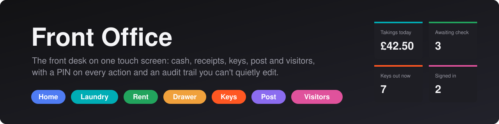
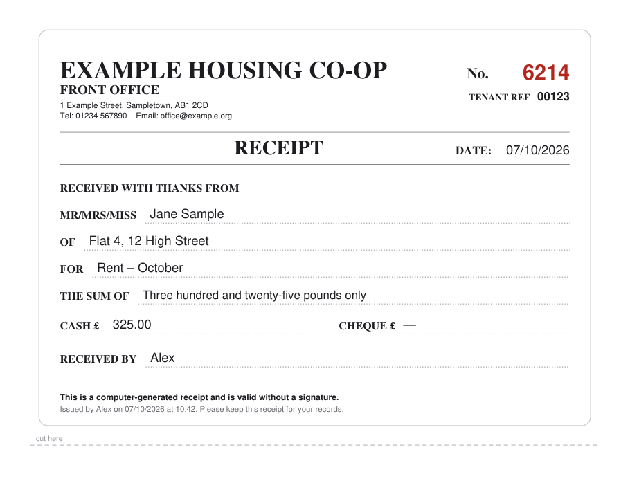
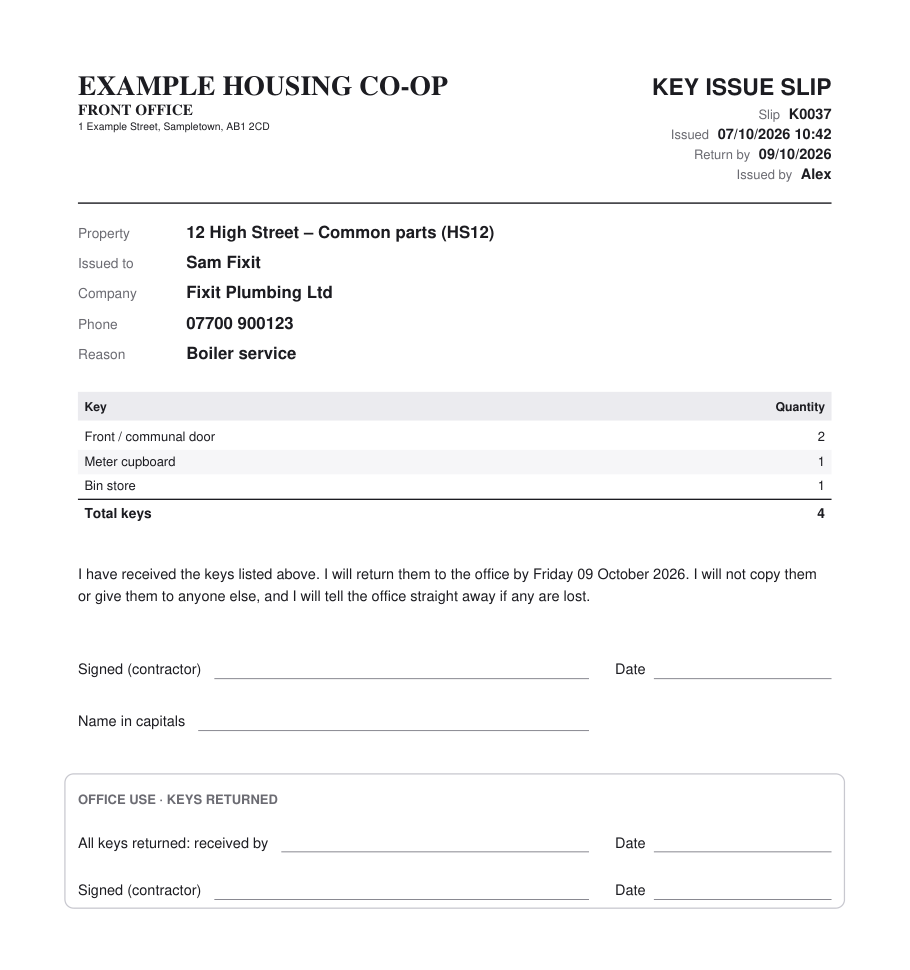
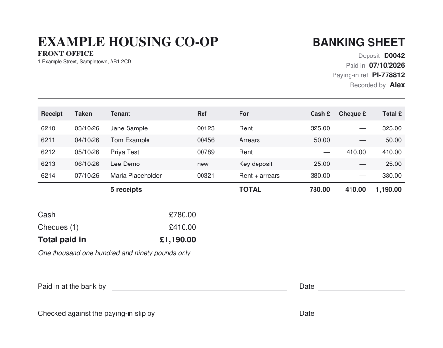

<p align="center">
  
</p>

<p align="center">
  
  
  
  
  
</p>

A desktop app for a small office front desk, made for a touch-screen PC at the counter. It replaces the paper receipt book, the token tin, the key book, the post book and the visitor book. Every action needs a staff PIN, and each record is kept in a log that flags any edit made outside the app.

It needs no server, database or install: one `.exe` and a `data` folder next to it.

## What's in it

| | Tab | What it does |
|---|---|---|
| 🔵 | **Home** | Today at a glance: takings, receipts waiting to be checked, cash not yet banked, overdue keys, post waiting to be handed over, and visitors still signed in |
| 🟢 | **Laundry** | Point of sale for washing and dryer tokens, by flat. Opens the cash drawer through a USB trigger. Voids, token stock and reports by day or by flat |
| 🟩 | **Rent** | Rent, arrears and deposits taken at the desk, each with a numbered PDF receipt. A second person checks the money into the safe, then it's banked with a printed banking sheet |
| 🟠 | **Drawer** | Cash in the drawer now, no sale and change, counts, petty cash, and emptying the drawer for banking |
| 🔶 | **Keys** | Keys lent to contractors, with a printed slip to sign. Shows what's still out and what's overdue, and records part-returns and lost keys |
| 🟣 | **Post** | Recorded post in (handed over to whom, and when) and out (method, tracking number, cost) |
| 🩷 | **Visitors** | The visitor book, filled in by staff, with sign-in and sign-out times |

## Paperwork it prints

Every document is a PDF made by the app, and your organisation's name and address go on it from **Settings**. The samples below use made-up data.

<table>
  <tr>
    <td width="50%" valign="top"><b>Rent receipt</b><br></td>
    <td width="50%" valign="top"><b>Key issue slip</b><br></td>
  </tr>
  <tr>
    <td width="50%" valign="top"><b>Banking sheet</b><br></td>
    <td width="50%" valign="top">
      <b>Also printed or exported</b>
      <ul>
        <li>Laundry token banking sheets</li>
        <li>Tenant payment statements</li>
        <li>Excel and CSV exports of every log</li>
      </ul>
    </td>
  </tr>
</table>

## Built to be trusted with cash

- **A PIN on every action.** Each sale, receipt, check, key loan and sign-out records who did it. PINs are stored as salted hashes.
- **Logs are only ever added to.** Nothing is edited or deleted. A void or cancellation is a new row that points back to the original.
- **Hand edits are flagged.** Each row carries a hash of itself plus the row before it. If a log is changed in Excel or Notepad, the app shows exactly where.
- **Two people handle rent money.** One takes the payment, and a checker confirms it before it goes in the safe. Receipt numbers are never reused.
- **Daily backups.** A copy of each log is saved every day, and the last 60 days are kept.
- **Safe updates.** To update, replace the `.exe`. New features create their own files on first run, so no data ever needs converting.

## Running from source

```
pip install pyserial pillow reportlab openpyxl
python source/front_office.py
```

The first run creates `data/`, `receipts/`, `banking/`, `keys/` and `backups/` next to `source/`. The default admin PIN is **1234**, and the app keeps warning you until it's changed.

## Building the .exe

```
pip install pyinstaller
source\build_exe.bat
```

This builds `Front Office.exe` as a single file in the repository root. To brand it, put a `logo.png` (and optionally an `app.ico`) in `source/` before you build.

## Updating a live install

1. Press **Exit** in the app.
2. Rename the old `Front Office.exe` to `Front Office.exe.old`, as a way back.
3. Copy in the new `.exe` and start it.

Never copy `data/`, `receipts/`, `banking/`, `keys/` or `backups/` from a test copy. They hold the live records.

## Requirements

Windows 10 or 11, a PDF viewer (Edge is fine) and a default printer. The cash drawer is optional and needs a USB trigger box (virtual COM port). The app finds it automatically, or you can set it in **Settings → Cash drawer**.
